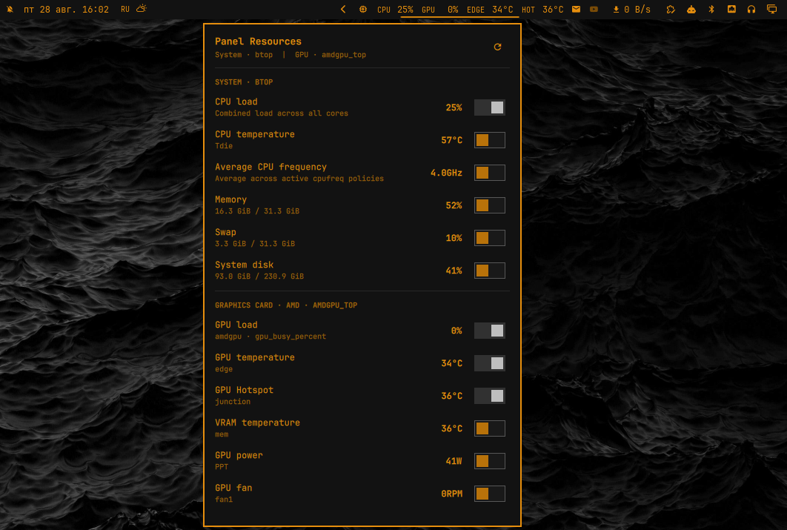

# Panel Resources

Selectable CPU, memory, disk, and GPU telemetry for the Omarchy QuickShell bar. Panel Resources 0.4.0 is available as a verified marketplace snapshot.

[View Panel Resources in the Omarchy Plugin Marketplace](https://omarchyplugins.com/plugin.html?id=io.github.villainru.panel-resources)



## Installation and Updates

Install the current upstream version and enable it on the bar:

```bash
omarchy plugin add https://github.com/VillainRU/omarchy-panel-resources.git --enable
```

If it was installed without `--enable`, place it in the right section:

```bash
omarchy plugin enable io.github.villainru.panel-resources right
```

Update a Git-managed installation:

```bash
omarchy plugin update io.github.villainru.panel-resources
```

If an older manually copied installation reports that it is not a Git checkout, remove it and run the installation command again. Omarchy backs up non-Git plugin directories during removal.

```bash
omarchy plugin remove io.github.villainru.panel-resources
```

## Metrics and Settings

- System: CPU load, temperature, package power and average frequency; RAM, swap, and root disk usage.
- AMD: GPU load, edge, hotspot and memory temperatures; VRAM, power, fan, and clock.
- NVIDIA: GPU load, temperature, VRAM, power, fan, and clock.

Only sensors exposed by the current hardware are listed. CPU load and temperature plus GPU load and the primary GPU temperature are enabled by default; every available metric can be toggled from the **System** tab. Settings are stored in the widget's own entry in Omarchy `shell.json`.

The refresh interval is configurable from 1 to 30 seconds and defaults to 2 seconds. The icon opens the popup, right-clicking it forces a hardware rescan, and left-clicking a metric opens its detailed monitor. The UI follows the system message locale: Russian is used for `ru_*`; English is the fallback.

## Collection Architecture

One shared service owns one persistent collector, regardless of the number of monitors. Hardware paths and dependency availability are detected at startup and rescanned after a read failure, a manual refresh, or ten minutes. The first snapshot inventories all available sensors; later snapshots sample only enabled metrics.

CPU load is calculated between consecutive `/proc/stat` readings without an extra sampling delay. AMD telemetry is read directly from DRM/sysfs and labeled `hwmon` sensors. NVIDIA uses one persistent `nvidia-smi --loop-ms` query instead of launching a process for every refresh.

The collector is supervised by a QML heartbeat and restarted if it stalls. Each snapshot is limited to 8 KiB, 16 allowlisted metric IDs, and eight allowlisted dependency IDs. Displayed fields are length-bounded, sanitized, and rendered as plain text.

## Requirements and Optional Tools

Required runtime interfaces and commands:

- Omarchy with the QuickShell plugin system;
- Bash, `awk`, `df`, `realpath`, `sleep`, and readable Linux `/proc` and `/sys` interfaces;
- the installed GPU driver and its unprivileged telemetry interfaces.

Optional detailed monitors opened from bar metrics:

- `btop` for CPU, memory, and disk metrics;
- `amdgpu_top` for AMD GPU metrics;
- `nvtop` for NVIDIA GPU metrics.

AMD package power can use `zenpower` SVI2 Core and SoC rails or another explicit CPU/package, socket, or PPT `hwmon` channel. NVIDIA telemetry requires `nvidia-smi`.

The **Dependencies** tab reports which drivers and optional monitors are available. Its project links are fixed, allowlisted GitHub URLs; the plugin never installs dependencies automatically.

Telemetry collection does not use the network or require elevated privileges. Network access is used only when installing or updating the plugin and when opening an allowlisted dependency project page. The plugin changes only its own widget settings through the Omarchy shell API.

## Validation

Run the complete repository validation suite before submitting changes:

```bash
make check
```
